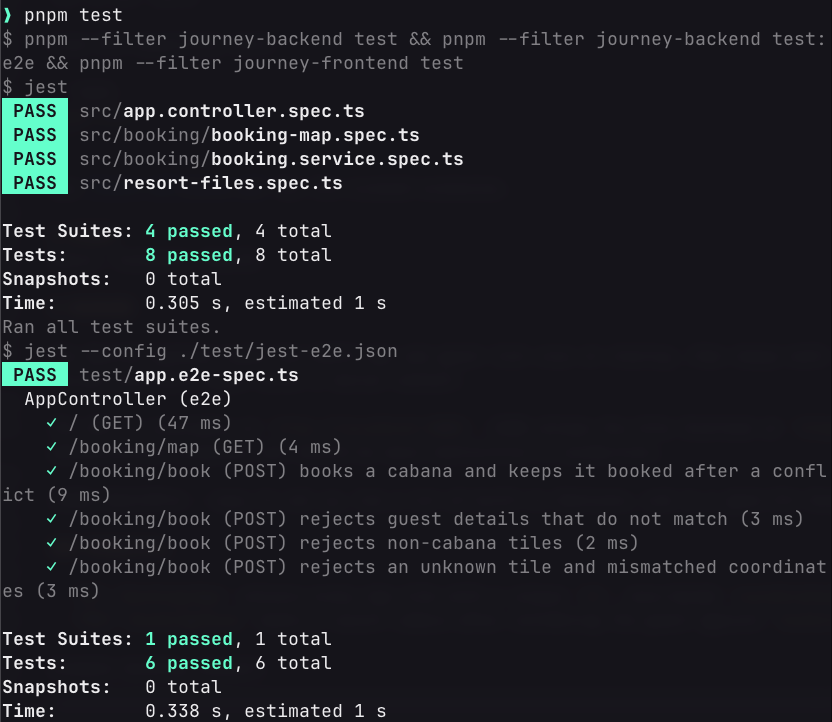
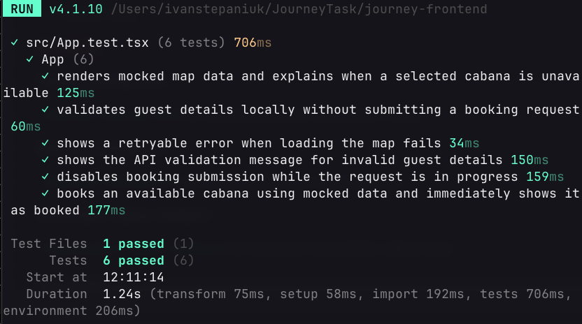
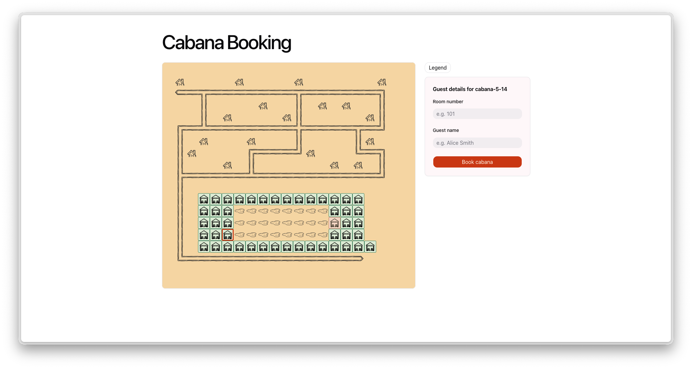
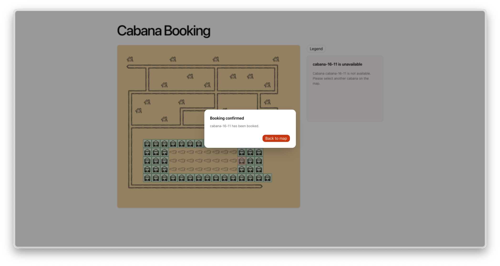
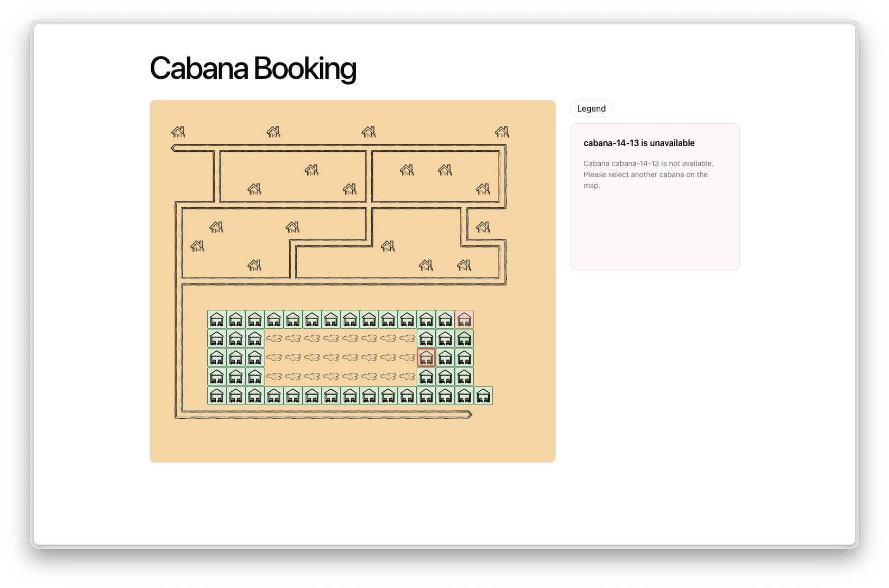
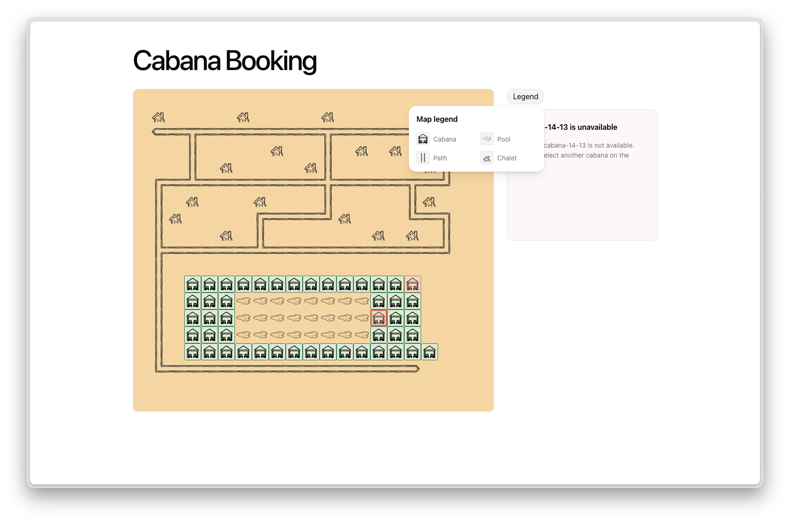
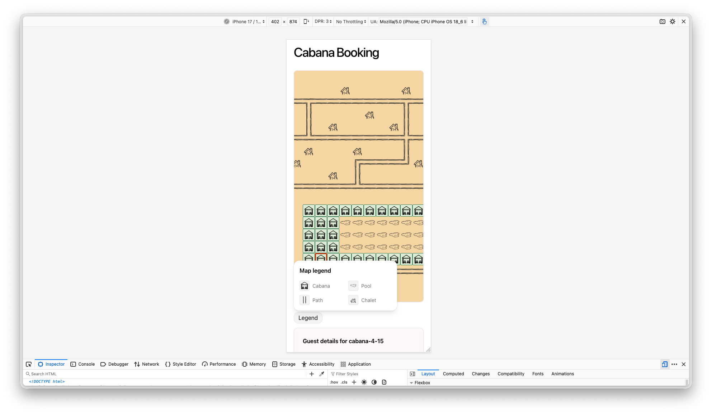

# My Assumptions
1. Initially, all cabanas are available.
2. `bookings.json` is actually the guest-validation list.
3. That cabana becomes unavailable until the server restarts.
4. Names can't contain any numbers.
5. Several nearby map tiles represent pools rather than water.
6. The supplied PNG map assets were converted into reusable TSX components for direct use in the React map.

# README

This is a monorepo containing the [frontend](journey-frontend) and [backend](journey-backend) applications for the journey task.
Monorepo structure was chosen to simplify dependency management, streamline development, and facilitate testing across both applications.

# HOW TO RUN

From the repository root, install dependencies and start both applications:

```bash
pnpm install
pnpm dev
```

By default, the backend uses `map.ascii` and `bookings.json` from the repository root. Both files must be readable. Paths are resolved from the repository root.

For alternate input files:

```bash
pnpm dev -- --map <path> --bookings <path>
```

How to run tests 

From the repository root:

```bash
pnpm test
```

See [tests.md](tests.md) for the covered scenarios.

# STACK
React, Tailwind, NestJS

# BACKEND

The NestJS backend loads the ASCII map and guest list once at startup, then keeps both in memory. Successful bookings update only the in-memory tile state, so all cabanas become available again after a server restart.

The API is available at `http://localhost:8081`. CORS allows the Vite frontend at `http://localhost:3001` to call it via proxy. CORS is configured permissively for demonstration purposes and should be more restrictive in production.

**Why NestJS?** - easy to set up, has a lot of built-in features, and is a good fit for REST APIs. It also has a nice CLI for generating boilerplate code and tests

### Endpoints

- `GET /booking/map` returns every map tile with a unique `id`, zero-based `coordinates`, `name`, and `vacant` status.
- `POST /booking/book` books a vacant cabana after validating the guest against `bookings.json`.

Example booking request:

```json
{
  "tile": {
    "id": "cabana-11-2",
    "coordinates": { "x": 11, "y": 2 }
  },
  "user": {
    "room": "101",
    "guestName": "Alice Smith"
  }
}
```

Only cabanas can be booked. Invalid guest details, a missing tile, and an already-booked cabana return a short error response.

### Tests

```bash
cd journey-backend
pnpm install
pnpm test
```


# FRONTEND

The frontend uses **React**, **TypeScript**, and **Vite**, with **Tailwind** and **shadcn/ui** components to provide an accessible interface. The booking form uses **React Hook Form** with **Zod** for client-side input validation.

Tailwind was used as the native styling solution for shadcn/ui, saving time establishing a component foundation and avoiding the need to rebuild existing components.

Vite was used for the monorepo setup, fast builds, and test integration. Although it may seem like overkill, its boilerplate saves time on this task.

### Tests

```bash
cd journey-frontend
pnpm install
pnpm test
```


## Results

Desktop booking flow:



Booking confirmation:



Unavailable-cabana feedback:



Map legend:



Mobile version (the final screenshot):



## AI workflow

See [AI.md](AI.md) for the tools and workflow used.
